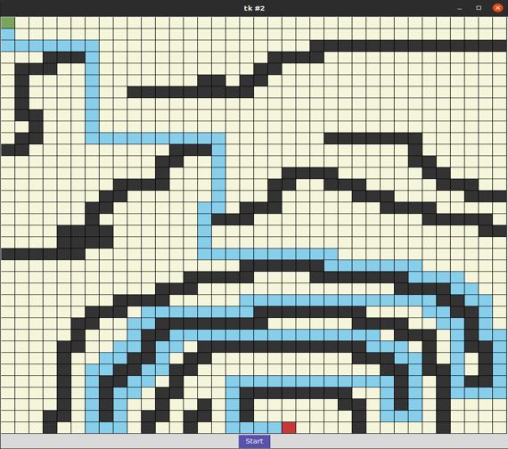
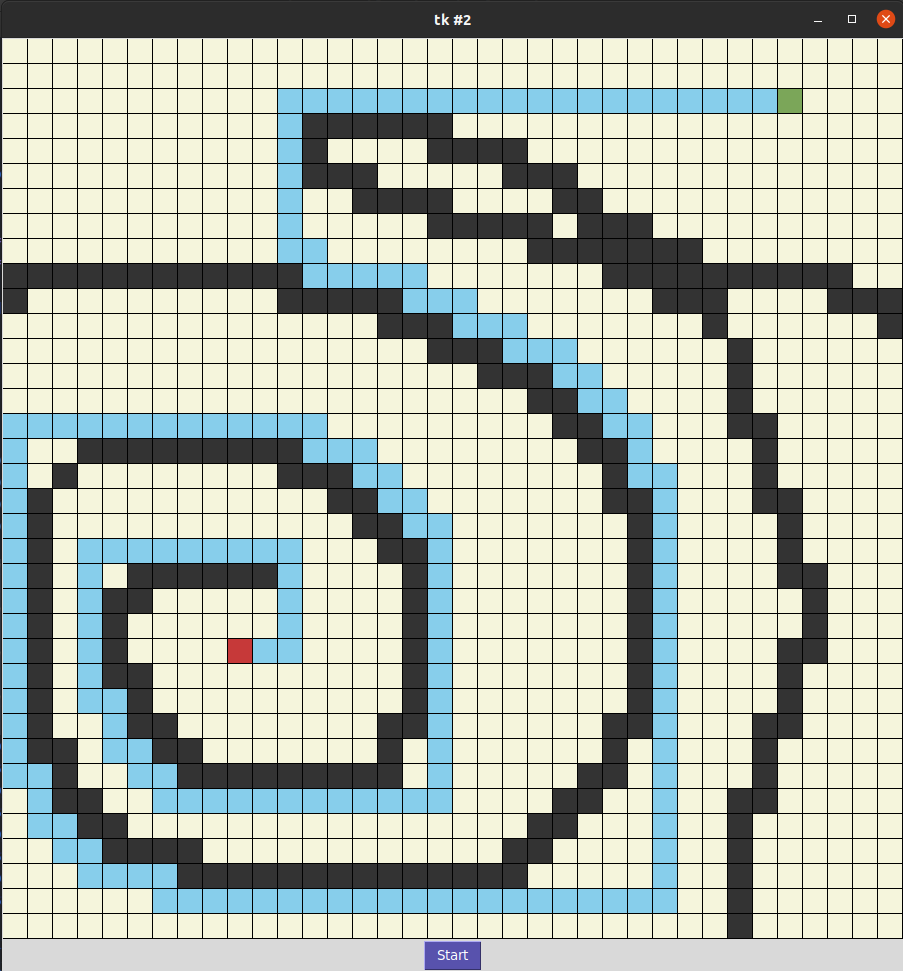
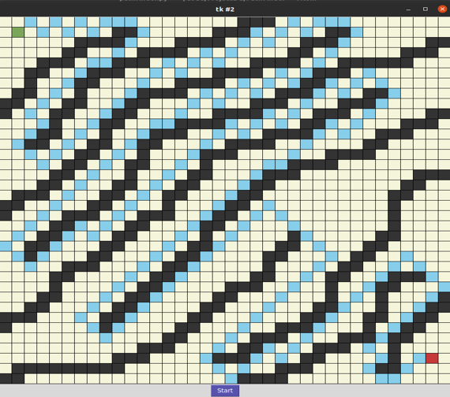

# Pathfinder-Python

A shortest path finding visualizer using BFS algorithm


To install dependencies (assuming you have python installed on your computer, if you don't make a quick search it's very easy)


## For Linux/Mac:
```
sudo apt-get install python3-tk
```

Windows dependencies come auto installed!


## Execution:

To execute the program plot a start and end point by 
key combination **ctrl+mouse1** and **ctrl+mouse2/3**.
You Can change this based on mouse prefrence 
if you have different mouse configurations, 
the code for changing is towards very bottom. 
Then create obstacles or road blocks by **drag selecting**(holding the left click) 
the mouse across the grid.

Hit start to run.

Examples:






